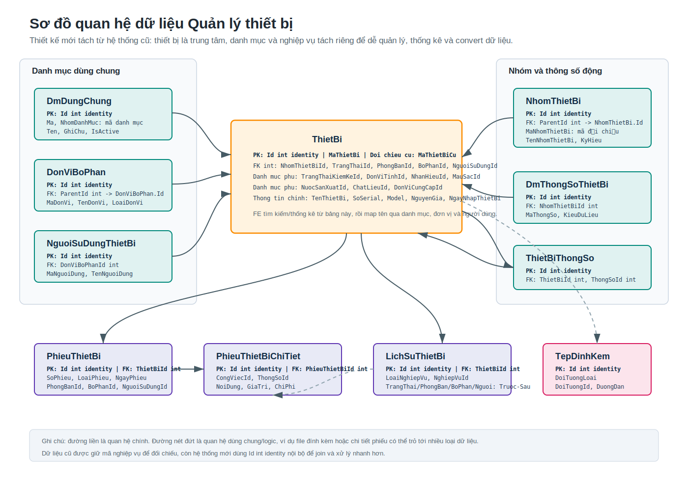
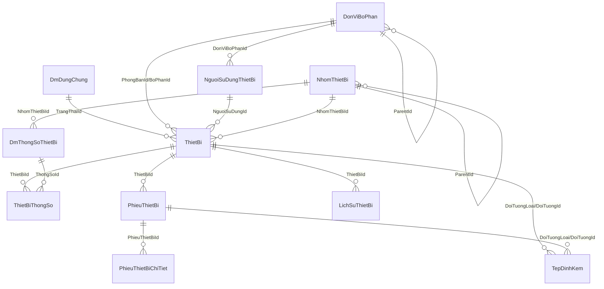

# Sơ đồ mối quan hệ bảng QLTB

Cập nhật: 2026-07-03

Tài liệu này mô tả cấu trúc dữ liệu mới của hệ thống Quản lý thiết bị sau khi tách từ dữ liệu cũ. Mục tiêu là để BE, FE và bên nghiệm thu nhìn được thiết bị đang liên quan tới danh mục, phòng ban, người sử dụng, phiếu nghiệp vụ và lịch sử như thế nào.

Trong hình, mỗi bảng có ghi nhanh các trường quan trọng: `PK` là khóa chính `Id int identity`, `FK` là khóa tham chiếu kiểu `int`, còn các trường như `MaThietBi`, `MaThietBiCu`, `MaNguoiDung`, `MaNhomThietBi` là mã nghiệp vụ/mã đối chiếu với dữ liệu cũ hoặc hệ thống ngoài.

## 1. Nguyên tắc thiết kế

- `Id` là khóa chính nội bộ, kiểu `int identity`, dùng để join nhanh và dễ đọc hơn `uniqueidentifier`.
- Các mã nghiệp vụ như `MaThietBi`, `MaNhomThietBi`, `MaDonVi`, `MaNguoiDung` vẫn được giữ để đối chiếu dữ liệu cũ và trao đổi với hệ thống khác.
- Hồ sơ thiết bị nằm ở bảng trung tâm `ThietBi`.
- Các tên danh mục không lưu lặp lại trên thiết bị, chỉ lưu `Id` tham chiếu tới bảng danh mục.
- Những thay đổi quan trọng của thiết bị phải ghi vào `LichSuThietBi`.
- Người nhập/người sửa dữ liệu mới lấy từ bearer token, so theo `MaNguoiDung`.

## 2. Sơ đồ tổng quan

Ghi chú: sơ đồ trên thể hiện quan hệ chính. Một số cột là quan hệ logic tới danh mục dùng chung nhưng chưa ép foreign key vật lý trong SQL để thuận tiện convert dữ liệu cũ.

## 3. Nhóm bảng danh mục

### `DmDungChung`

Lưu các danh mục nhỏ dùng chung cho nhiều nghiệp vụ.

Ví dụ nhóm danh mục:

- `TRANG_THAI_TB`: trạng thái thiết bị.
- `TRANG_THAI_KK`: trạng thái kiểm kê.
- `DON_VI_TINH`: đơn vị tính.
- `NHAN_HIEU`: nhãn hiệu.
- `MAU_SAC`: màu sắc.
- `NUOC_SAN_XUAT`: nước sản xuất.
- `CHAT_LIEU`: chất liệu.
- `DON_VI_CUNG_CAP`: đơn vị cung cấp.
- `KET_LUAN`: kết luận sửa chữa/bảo trì.
- `CONG_VIEC_BTBD`: công việc bảo trì, bảo dưỡng.

Quan hệ sử dụng:

- `ThietBi.TrangThaiId` có FK vật lý tới `DmDungChung.Id`.
- `ThietBi.TrangThaiKiemKeId`, `DonViTinhId`, `NhanHieuId`, `MauSacId`, `NuocSanXuatId`, `ChatLieuId`, `DonViCungCapId` là tham chiếu logic tới `DmDungChung.Id`.
- `PhieuThietBi.KetLuanId` là tham chiếu logic tới nhóm `KET_LUAN`.
- `PhieuThietBiChiTiet.CongViecId` là tham chiếu logic tới nhóm `CONG_VIEC_BTBD`.
- `DmThongSoThietBi.DonViTinhId` là tham chiếu logic tới nhóm `DON_VI_TINH`.

### `DonViBoPhan`

Lưu cây đơn vị, phòng ban, bộ phận.

Quan hệ:

- `ParentId` trỏ về chính `DonViBoPhan.Id` để tạo cây cha con.
- `NguoiSuDungThietBi.DonViBoPhanId` trỏ tới đơn vị/bộ phận của người dùng.
- `ThietBi.PhongBanId` và `ThietBi.BoPhanId` trỏ tới nơi đang quản lý/sử dụng thiết bị.
- Các cột `PhongBanId`, `BoPhanId`, `DonViThucHienId` trong `PhieuThietBi` là tham chiếu logic tới bảng này.
- Các cột phòng ban/bộ phận trước sau trong `LichSuThietBi` cũng là tham chiếu logic tới bảng này.

### `NguoiSuDungThietBi`

Lưu người sử dụng hoặc người phụ trách thiết bị.

Quan hệ:

- Mỗi người có thể thuộc một `DonViBoPhan`.
- `ThietBi.NguoiSuDungId` cho biết người đang sử dụng thiết bị hiện tại.
- `PhieuThietBi.NguoiSuDungId` lưu người liên quan tại thời điểm lập phiếu.
- `LichSuThietBi.NguoiSuDungTruocId` và `NguoiSuDungSauId` lưu thay đổi người sử dụng.
- Token đăng nhập lấy `MaNguoiDung` để xác định người nhập/người sửa.

### `NhomThietBi`

Lưu cây nhóm thiết bị.

Quan hệ:

- `ParentId` trỏ về chính `NhomThietBi.Id`.
- Nhóm cha thường là nhóm đối tượng lớn từ hệ thống cũ.
- Nhóm con là nhóm thiết bị cụ thể để gắn cho hồ sơ thiết bị.
- Thiết bị nào chưa xác định được nhóm chính xác sẽ được đưa vào nhóm `KHONG_XAC_DINH` để vẫn quản lý được tài sản và rà soát sau.
- `ThietBi.NhomThietBiId` trỏ tới nhóm thiết bị.
- `DmThongSoThietBi.NhomThietBiId` dùng để khai báo bộ thông số riêng cho từng nhóm.

## 4. Nhóm bảng hồ sơ thiết bị

### `ThietBi`

Đây là bảng trung tâm, lưu hồ sơ chính của từng thiết bị.

Dữ liệu chính:

- Mã thiết bị mới: `MaThietBi`.
- Mã thiết bị cũ để đối chiếu: `MaThietBiCu`.
- Tên, serial, model, mã kế toán.
- Nhóm thiết bị, trạng thái, trạng thái kiểm kê.
- Phòng ban, bộ phận, người sử dụng hiện tại.
- Ngày mua, ngày nhập, ngày đưa vào sử dụng, nguyên giá, bảo hành.
- Các thuộc tính danh mục như nhãn hiệu, màu sắc, nước sản xuất, chất liệu, đơn vị cung cấp.

Khi FE cần hiển thị danh sách tìm kiếm/thống kê, dữ liệu trả ra nên gồm:

- Mã thiết bị.
- Tên thiết bị.
- Trạng thái thiết bị.
- Tên người sử dụng.
- Tên phòng ban.
- Tên bộ phận.
- Nhóm/danh mục thiết bị.

### `DmThongSoThietBi`

Lưu định nghĩa thông số động theo từng nhóm thiết bị.

Ví dụ: nhóm máy bơm có công suất, lưu lượng; nhóm xe có biển số, số khung, số máy. Nhờ bảng này, hệ thống không cần thêm cột vào `ThietBi` mỗi khi phát sinh loại thông số mới.

### `ThietBiThongSo`

Lưu giá trị thông số cụ thể của từng thiết bị.

Quan hệ:

- `ThietBiId` trỏ tới thiết bị.
- `ThongSoId` trỏ tới định nghĩa thông số.
- Giá trị được lưu theo kiểu dữ liệu: text, number, date hoặc bit.
- Một thiết bị chỉ có một giá trị cho một thông số, ràng buộc bởi cặp `ThietBiId` và `ThongSoId`.

## 5. Nhóm bảng nghiệp vụ và lịch sử

### `PhieuThietBi`

Lưu các phiếu nghiệp vụ phát sinh với thiết bị.

Ví dụ loại phiếu:

- `NHAP_KHO`: nhập kho.
- `CAP_PHAT`: cấp phát.
- `LUAN_CHUYEN`: luân chuyển.
- `THU_HOI`: thu hồi.
- `SUA_CHUA`: sửa chữa.
- `BAO_TRI`: bảo trì.
- `THANH_LY`: thanh lý.

Mỗi phiếu gắn với một thiết bị qua `ThietBiId`. Phiếu có thể lưu phòng ban, bộ phận, người sử dụng, đơn vị thực hiện, kết luận, chi phí và nội dung nghiệp vụ tại thời điểm phát sinh.

### `PhieuThietBiChiTiet`

Lưu dòng chi tiết của phiếu.

Dùng cho các nghiệp vụ có nhiều công việc hoặc nhiều thông số cần ghi nhận, ví dụ một phiếu bảo trì gồm nhiều hạng mục kiểm tra/sửa chữa.

Quan hệ:

- `PhieuThietBiId` trỏ tới phiếu cha.
- `CongViecId` tham chiếu logic tới danh mục công việc bảo trì/bảo dưỡng.
- `ThongSoId` tham chiếu logic tới thông số thiết bị nếu dòng chi tiết liên quan tới một thông số cụ thể.

### `LichSuThietBi`

Lưu lịch sử thay đổi của thiết bị.

Mỗi dòng lịch sử trả lời được các câu hỏi:

- Thiết bị nào thay đổi?
- Loại nghiệp vụ gì?
- Trước đó trạng thái/phòng ban/bộ phận/người sử dụng là gì?
- Sau đó trạng thái/phòng ban/bộ phận/người sử dụng là gì?
- Phát sinh ngày nào?
- Ai nhập dữ liệu?

`NghiepVuId` là mã tham chiếu tới nghiệp vụ phát sinh, thường là `PhieuThietBi.Id` khi lịch sử được sinh ra từ phiếu.

### `TepDinhKem`

Lưu file đính kèm theo kiểu dùng chung.

Không tạo FK cố định vì file có thể gắn với nhiều loại đối tượng khác nhau.

Ví dụ:

- `DoiTuongLoai = THIET_BI`, `DoiTuongId = ThietBi.Id`.
- `DoiTuongLoai = PHIEU_THIET_BI`, `DoiTuongId = PhieuThietBi.Id`.

Hiện tại phần file chưa ưu tiên convert, nhưng bảng đã để sẵn để mở rộng sau.

## 6. Tách dữ liệu cũ sang thiết kế mới

Dữ liệu cũ có xu hướng gom nhiều thông tin vào một bảng hồ sơ thiết bị rộng. Thiết kế mới tách ra để tránh trùng tên, dễ lọc thống kê và dễ mở rộng.

| Dữ liệu cũ | Bảng mới | Cách hiểu |
| --- | --- | --- |
| Hồ sơ thiết bị chính | `ThietBi` | Lưu phần lõi của tài sản/thiết bị. |
| Mã thiết bị cũ | `ThietBi.MaThietBiCu` | Giữ để đối chiếu khi kiểm tra dữ liệu convert. |
| Nhóm đối tượng, nhóm thiết bị | `NhomThietBi` | Tách thành cây cha con bằng `ParentId`. |
| Nhóm chưa xác định | `NhomThietBi` mã `KHONG_XAC_DINH` | Giữ riêng để không mất dữ liệu tài sản. |
| Phòng ban, bộ phận | `DonViBoPhan` | Tách thành cây đơn vị/bộ phận. |
| Người sử dụng | `NguoiSuDungThietBi` | Gắn lại với phòng ban/bộ phận nếu có dữ liệu. |
| Trạng thái, đơn vị tính, nhãn hiệu, màu sắc, nước sản xuất, chất liệu | `DmDungChung` | Mỗi loại nằm trong một `NhomDanhMuc`. |
| Thông số kỹ thuật thay đổi theo loại thiết bị | `DmThongSoThietBi`, `ThietBiThongSo` | Một bảng định nghĩa thông số, một bảng lưu giá trị. |
| Nghiệp vụ nhập, cấp phát, điều chuyển, sửa chữa, bảo trì | `PhieuThietBi`, `PhieuThietBiChiTiet` | Lưu phiếu và dòng chi tiết nghiệp vụ. |
| Lịch sử thiết bị | `LichSuThietBi` | Lưu trạng thái trước/sau để truy vết. |
| File scan, file hồ sơ | `TepDinhKem` | Gắn theo `DoiTuongLoai` và `DoiTuongId`. |
| LOG_USER, LOG_DATE hoặc người tạo cũ | Các cột audit | Dữ liệu convert lấy theo dữ liệu cũ; dữ liệu mới lấy từ token. |

## 7. Cách đọc dữ liệu thiết bị đầy đủ

Khi cần xem một hồ sơ thiết bị hoàn chỉnh:

1. Lấy dòng chính từ `ThietBi`.
2. Join `NhomThietBi` để lấy tên nhóm thiết bị và nhóm cha.
3. Join `DmDungChung` để lấy tên trạng thái và các danh mục phụ.
4. Join `DonViBoPhan` để lấy tên phòng ban, bộ phận.
5. Join `NguoiSuDungThietBi` để lấy người sử dụng hiện tại.
6. Lấy danh sách `ThietBiThongSo` kèm `DmThongSoThietBi` để hiển thị thông số động.
7. Lấy `PhieuThietBi` và `PhieuThietBiChiTiet` để xem nghiệp vụ phát sinh.
8. Lấy `LichSuThietBi` để xem quá trình thay đổi.
9. Lấy `TepDinhKem` nếu cần hồ sơ/file scan.

## 8. Lưu ý cho FE và bên kiểm thử

- Không hiển thị trực tiếp `Id` cho người dùng cuối, chỉ dùng để gọi API và join dữ liệu.
- Màn hình tìm kiếm nên lọc theo `phong_ban_id`, `bo_phan_id`, `nhom_thiet_bi_id`; nếu không truyền tham số thì hiểu là tìm tất cả.
- Khi hiển thị tên danh mục, FE lấy danh sách danh mục theo nhóm rồi map từ `Id` sang tên.
- Nếu thấy thiết bị thuộc nhóm `KHONG_XAC_DINH`, đó không phải lỗi mất dữ liệu. Đây là dữ liệu cũ chưa xác định được nhóm đúng, cần rà soát nghiệp vụ sau.
- Các thao tác thêm/sửa/xóa nghiệp vụ cần truyền bearer token để BE lấy `MaNguoiDung` làm người nhập/người sửa.
